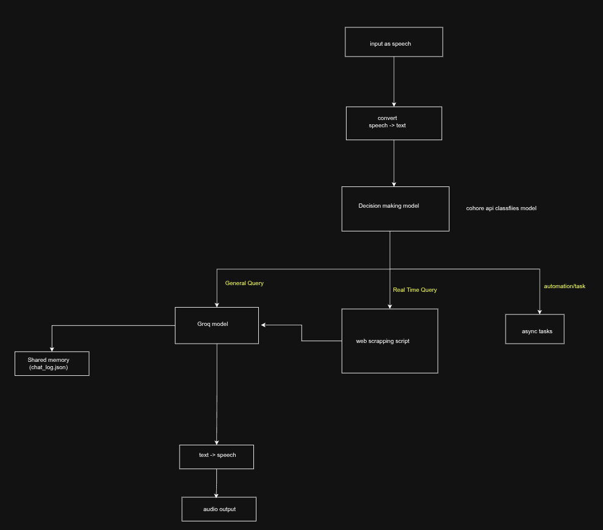

# System Specification: Modular AI Assistant (Jarvis)

## 1. System Objective

To build a multi-threaded, low-latency Desktop AI Assistant capable of semantic routing, real-time data scraping, concurrent local automation, and multi-modal interactions.

## 2. Core Architecture

The system utilizes a decoupled architecture running on two primary threads:

* **Thread 1 (Frontend):** Handles GUI rendering (HTML/CSS/JS or PyQt) and status state updates.
* **Thread 2 (Backend):** Manages the asynchronous event loop for API calls, hardware I/O, and local OS execution.

## 3. Data Flow & Execution Paths

The system captures audio via Selenium-automated web dictation. The extracted text is routed via the **Cohere Classification API** into one of four distinct nodes:

### Path A: General Node

* **Trigger:** Standard conversational queries or static logic requests.
* **Execution:** Routed to **Groq API** (Llama model).
* **State:** Reads and updates context from `data/chat_log.json`.

### Path B: Real-Time Node

* **Trigger:** Queries requiring current events, market data, or live weather.
* **Execution:** Triggers Python web scraper (`requests` + `bs4`). Extracts text -> Injects into Groq prompt -> Synthesizes response.

### Path C: Automation Node

* **Trigger:** Hardware commands, app launching, or system configurations.
* **Execution:** Bypasses LLMs. Executes local `os` or `subprocess` commands wrapped in `asyncio` to prevent I/O blocking.

### Path D: Image Generation Node

* **Trigger:** Explicit requests for visual content.
* **Execution:** Sends prompt to **Hugging Face API** (Stable Diffusion). Saves output locally and triggers default OS image viewer.

## 4. Output Pipeline

All text generated from Path A and Path B is processed through the **Edge TTS** library, encoded into an `.mp3` buffer, and executed via the **Pygame Mixer** audio channel.

## 5. Security Protocol

* No API keys (Cohere, Groq, HF) will be hardcoded in the primary scripts.
* All keys must be strictly injected via the `.env` file using the `python-dotenv` module.
